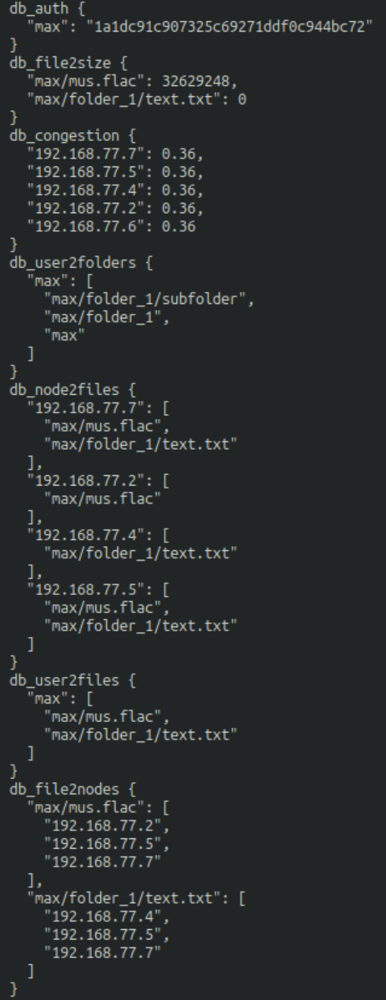
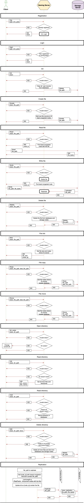

# DFS-PaLKa
Implementation of a simple fault-tolerant Distributed File System
for DS Course.

**P**opov Maxim\
**L**yamets Michail\
**K**ochetov Dmitry

Innopolis 2019

## How to launch
```console
docker stack deploy -c docker-compose.yml palka
```

## Architectural diagrams


## Database in Naming Server


## Redis dump after executing the following commands:
```console
./client.py reg max pass
./client.py mdir folder_1
./client.py mdir folder_1/subfolder 
./client.py fcreate folder_1/text.txt
./client.py fwrite mus.flac
```


## Description of communication protocols
